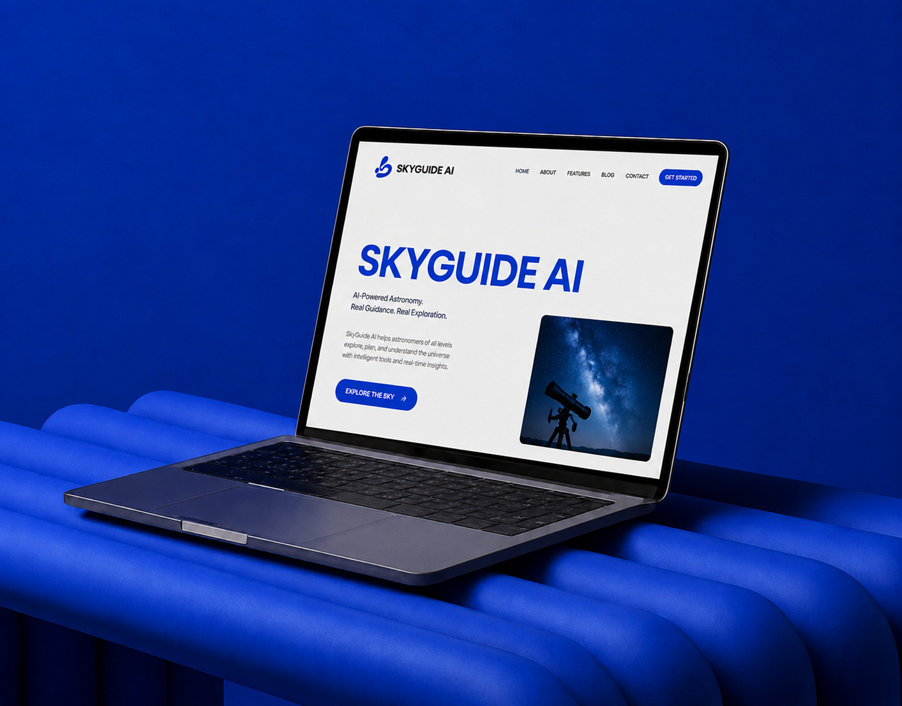
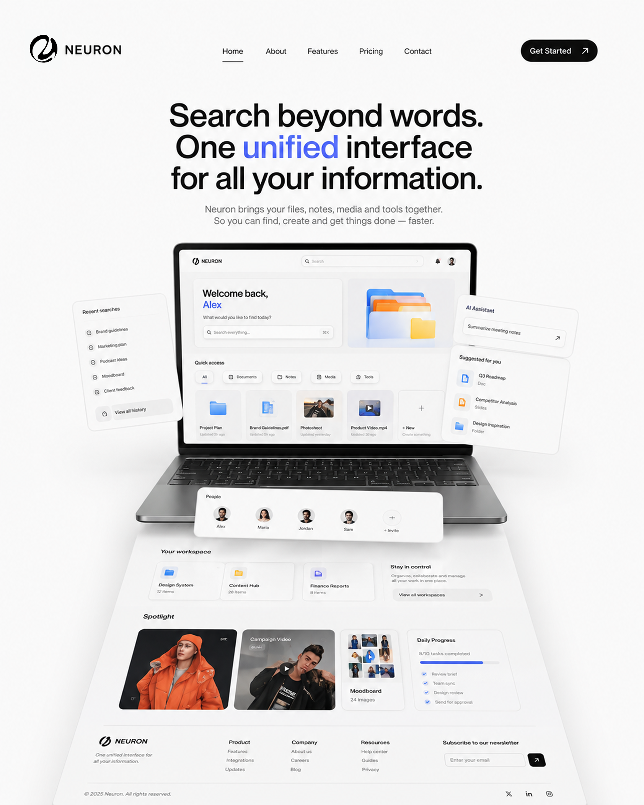
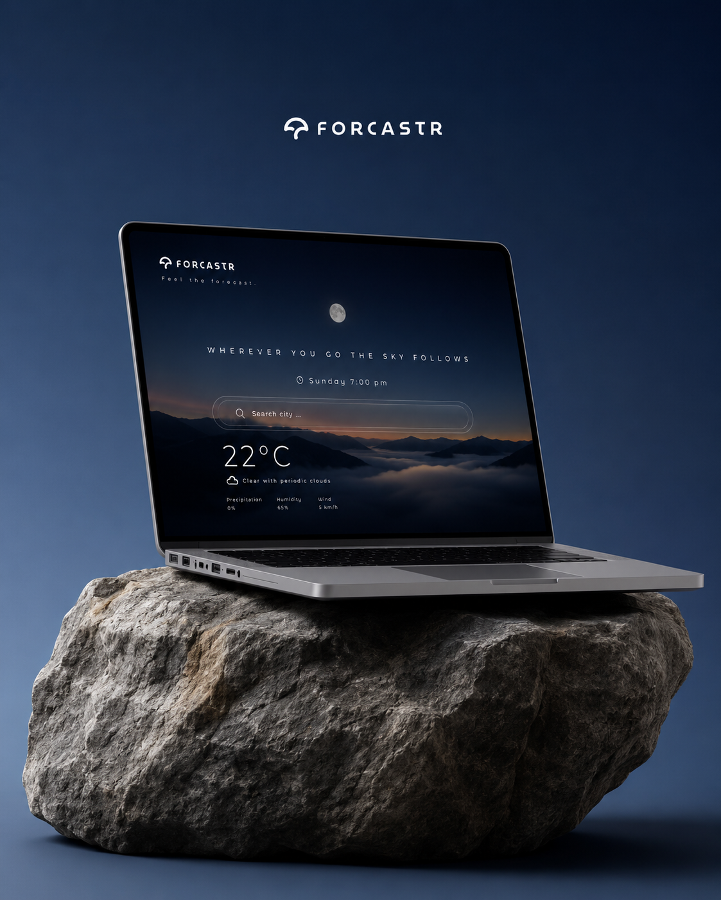

# Rohit Maity — Premium Engineering & Portfolio Showcase

A state-of-the-art, animation-rich monorepo portfolio built with **React 19**, **Vite**, **TypeScript**, **Tailwind CSS v4**, **GSAP**, **Express 5**, and a **Python FastAPI AI sidecar**. Featuring dark glassmorphism aesthetics, magnetic micro-interactions, custom page transitions, and detailed interactive case studies for high-impact full-stack and AI projects.

---

## 🌟 Overview & Highlights

- **Asset-Driven Architectural Case Studies**: Dedicated editorial project pages for **SkyGuide AI**, **Neuron**, **Yapchat**, and **Forcaster** featuring parallax media grids, interactive feature showcases, and engineering architecture breakdowns.
- **Physics-Based Micro-Interactions**: Magnetic cursor attraction (`useMagnetic`), velocity-aware smooth scrolling (Lenis), liquid page transitions, and kinetic typography.
- **Centralized "Global Knob" Configuration**: Single source of truth ([`apps/web/src/data/links.ts`](apps/web/src/data/links.ts)) managing all social profiles, project repository URLs, live demo links, and contact parameters across the entire application.
- **Live Contact Engine**: Functional contact form powered by Web3Forms API delivering user inquiries directly to email inbox.
- **Monorepo Architecture**: Clean separation between React frontend (`apps/web`), Express 5 API gateway (`apps/api`), Python FastAPI AI sidecar (`apps/ai`), and shared TypeScript schemas (`packages/shared`).

---

## 🔗 Live Demos & Project Links

| Project | Category | Live Demo / Status | Repository |
| :--- | :--- | :--- | :--- |
| **SkyGuide AI** | AI & Astronomy | [🌌 skyguide-ai.vercel.app](https://skyguide-ai.vercel.app) | [GitHub ↗](https://github.com/watermelon588/skyguide-ai) |
| **Forcaster** | Weather Experience | [🌤️ forcastr-wheat.vercel.app](https://forcastr-wheat.vercel.app/) | [GitHub ↗](https://github.com/watermelon588/FORCASTR) |
| **Yapchat** | Realtime Chat & WebRTC | [💬 yap-chat-five.vercel.app](https://yap-chat-five.vercel.app) | [GitHub ↗](https://github.com/watermelon588/Yap-Chat) |
| **Neuron** | Multimodal Search & RAG | 💻 Local / Desktop App (Not Hosted) | [GitHub ↗](https://github.com/watermelon588/Neuron) |

---

## 🎨 Featured Projects Showcase

### 1. 🌌 SkyGuide AI
*A real-time celestial matchmaking & telescope-alignment copilot fusing observer location, telescope parameters, atmospheric conditions, and Astropy positioning telemetry.*



---

### 2. 🧠 Neuron — Multimodal Search & Document Intelligence
*Search beyond words across text, images, audio, and video using unified CLIP query vectors with grounded document chat citations.*



---

### 3. 💬 Yapchat — Realtime Communication Platform
*Private code-based chat rooms with instant Socket.IO messaging and peer-to-peer 8-way WebRTC group video calling.*


---

### 4. 🌤️ Forcaster — Weather UI Experience
*Glassmorphism weather UI featuring dynamic sky theme synchronization, 5-day expandable forecasts, and 24h hourly breakdowns.*



---

## 🖼️ Application Pages & Routes

- **`/` (Home Page)**: Editorial Hero with kinetic typography, selected work preview strip, interactive contact cards, and site footer.
- **`/work` (Selected Work)**: Interactive full-viewport flowing marquee menu with horizontal-scroll image previews on cursor hover.
- **`/work/skyguide-ai`**: Celestial matchmaking & telescope alignment copilot case study.
- **`/work/neuron`**: Multimodal search (text, image, audio, video) & grounded document intelligence case study.
- **`/work/yapchat`**: Private code-based room chat with Socket.IO & 8-way WebRTC group video case study.
- **`/work/forcaster`**: Calm glassmorphism weather UI with dynamic sky themes and 5-day expandable forecast case study.
- **`/about`**: Personal philosophy, technical stack visualization, core principles, and experience timeline.
- **`/contact`**: Interactive contact cards, social links, magnetic CTA buttons, and direct Web3Forms contact form.
- **`/demo`**: Design system playground displaying magnetic buttons, hover reveal lists, preloader, and page transitions.

---

## 📁 Repository Folder Structure

```
portfolio/
├── apps/
│   ├── ai/                        # FastAPI Python AI sidecar (Voice + RAG)
│   │   ├── app/
│   │   │   ├── main.py            # FastAPI entry point & health endpoints
│   │   │   └── config.py          # Environment settings
│   │   ├── requirements.txt       # Python dependencies (FastAPI, Uvicorn, Pydantic)
│   │   └── README.md
│   │
│   ├── api/                       # Express 5 + TypeScript core API gateway
│   │   ├── src/
│   │   │   ├── index.ts           # Server entry point (CORS, Helmet, Pino)
│   │   │   └── routes/            # API routes
│   │   ├── package.json
│   │   └── tsconfig.json
│   │
│   └── web/                       # React 19 + Vite + Tailwind CSS v4 frontend
│       ├── public/                # Static favicon, brand assets & images
│       │   ├── pfp.png
│       │   └── pfp-round.png
│       ├── src/
│       │   ├── assets/            # Fingerprinted media artwork & galleries
│       │   │   ├── hero/          # Hero visuals
│       │   │   ├── skyguide/      # SkyGuide AI gallery & hero media
│       │   │   ├── Neuron/        # Neuron gallery & feature visuals
│       │   │   ├── Yap chat/      # Yapchat WebRTC & messaging screenshots
│       │   │   └── forcaster/     # Weather app UI & forecast assets
│       │   ├── components/        # Reusable UI components
│       │   │   ├── FeatureShowcase/# Interactive gallery slider
│       │   │   ├── motion/        # HoverRevealList, Magnetic, PageTransition, Preloader
│       │   │   ├── nav/           # Navbar & magnetic action links
│       │   │   └── vendor/        # FlowingMenu & ReactBits integration
│       │   ├── data/              # Application sources of truth ("Global Knobs")
│       │   │   ├── caseStudies.ts # Detailed case study metadata & narrative text
│       │   │   ├── links.ts       # Global links (Socials, repos, live URLs, API keys)
│       │   │   ├── nav.ts         # Navigation items
│       │   │   └── projects.ts    # Selected work project list & frame configs
│       │   ├── hooks/             # Custom React hooks (useLenis, useParallax)
│       │   ├── pages/             # Page views
│       │   │   ├── AboutPage.tsx
│       │   │   ├── ContactPage.tsx
│       │   │   ├── DemoPage.tsx
│       │   │   ├── ForcasterProjectPage.tsx
│       │   │   ├── Home.tsx
│       │   │   ├── NeuronProjectPage.tsx
│       │   │   ├── ProjectPage.tsx
│       │   │   ├── Work.tsx
│       │   │   └── YapChatProjectPage.tsx
│       │   ├── sections/          # Page sections (Hero, Work, About, ContactCards, Footer)
│       │   ├── styles/            # CSS tokens, design variables, and utilities
│       │   ├── main.tsx           # React root renderer
│       │   └── routes.tsx         # Client router definitions
│       ├── package.json
│       ├── vite.config.ts
│       └── vercel.json            # Vercel deployment rewrite rules
│
├── packages/
│   └── shared/                    # Shared workspace package (Zod schemas, tokens)
│       ├── src/
│       ├── package.json
│       └── tsconfig.json
│
├── docs/                          # Comprehensive technical documentation
│   ├── ARCHITECTURE.md
│   ├── DESIGN_SYSTEM.md
│   ├── CURRENT_STATE.md
│   └── PROJECT_ROADMAP.md
│
├── package.json                   # Root monorepo pnpm workspace package.json
├── pnpm-workspace.yaml            # pnpm workspace definition
├── vercel.json                    # Root Vercel deployment configuration
└── README.md                      # Project documentation
```

---

## 🛠️ Tech Stack & Key Dependencies

### Frontend (`apps/web`)
- **Core**: React 19, Vite 7, TypeScript 5.8, React Router 7
- **Styling**: Tailwind CSS v4, Custom Vanilla CSS Design System, Glassmorphism utilities
- **Animations & Physics**: GSAP 3.15, `@gsap/react`, Lenis Smooth Scroll
- **Icons & Visuals**: Lucide React / SVG Icon Set

### Backend (`apps/api`)
- **Runtime & Framework**: Node.js (≥22), Express 5, TypeScript
- **Security & Logging**: Cors, Helmet, Pino, Pino-HTTP, Zod

### AI Sidecar (`apps/ai`)
- **Runtime & Framework**: Python (≥3.12), FastAPI, Uvicorn, Pydantic, Structlog

---

## ⚙️ Prerequisites & Environment Setup

### System Requirements
- **Node.js**: `^22.0.0` or higher
- **pnpm**: `^10.0.0` or higher
- **Python**: `^3.12.0` or higher (for `apps/ai`)

### Environment Variables (`.env`)

Copy `.env.example` templates in workspace packages if needed:

```bash
# apps/web (Optional environment overrides)
VITE_WEB3FORMS_KEY="656aa372-69dc-4538-9589-82376c182405"
```

---

## 🚀 Getting Started & Installation

### 1. Clone the Repository
```bash
git clone https://github.com/watermelon588/portfolio.git
cd portfolio
```

### 2. Install Monorepo Dependencies
```bash
pnpm install
```

### 3. Run Development Servers

#### Option A: Run Web & API Gateways Simultaneously
```bash
pnpm dev
```
- **Web App**: `http://localhost:5173`
- **Express API**: `http://localhost:4000/api/health`

#### Option B: Run Web App Only
```bash
pnpm dev:web
```

#### Option C: Run Express API Gateway Only
```bash
pnpm dev:api
```

#### Option D: Run Python FastAPI AI Sidecar
```bash
cd apps/ai
python -m venv .venv

# On Windows (PowerShell):
.venv\Scripts\Activate.ps1

# On macOS/Linux:
source .venv/bin/activate

pip install -r requirements.txt
uvicorn app.main:app --reload --port 8000
```
- **AI Health Endpoint**: `http://localhost:8000/ai/health`

---

## 📦 Production Build & Quality Commands

```bash
# Production bundle build across workspaces
pnpm run build

# TypeScript static type check across all workspaces
pnpm run typecheck

# Lint workspace projects
pnpm run lint
```

---

## 🌐 Deploying to Vercel

This project is configured out-of-the-box for seamless Vercel deployment via the root [`vercel.json`](vercel.json):

```json
{
  "buildCommand": "pnpm --filter web build",
  "outputDirectory": "apps/web/dist",
  "rewrites": [
    {
      "source": "/(.*)",
      "destination": "/index.html"
    }
  ]
}
```

### Deployment Steps:
1. Connect repository `watermelon588/portfolio` to **Vercel**.
2. Set **Framework Preset** to `Vite`.
3. Keep default settings (`vercel.json` will automatically route build commands to `pnpm --filter web build` and output to `apps/web/dist`).
4. Click **Deploy**.

---

## 📜 License & Copyright

© 2026 **Rohit Maity**. All rights reserved.  
Designed & engineered with precision.
