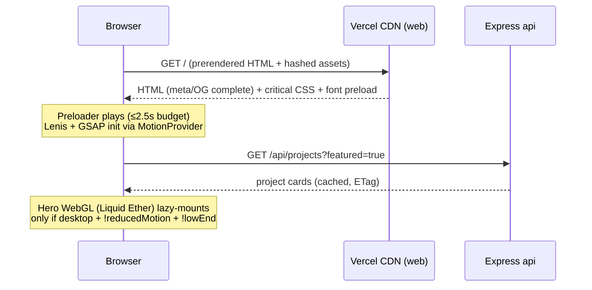
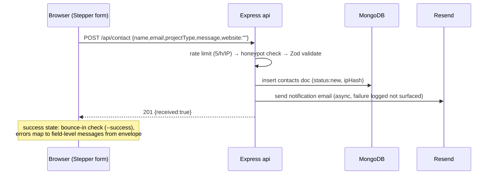
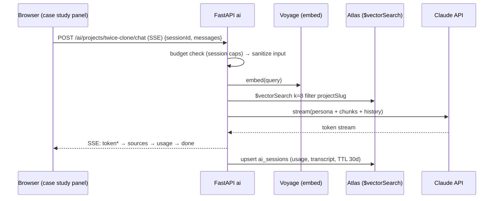
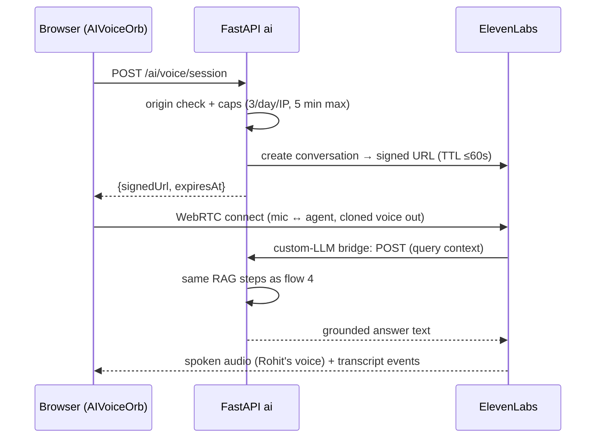

# REQUEST_FLOWS.md

> **Status:** Designed, pre-implementation · **Last updated:** 2026-07-09
> Sequence walkthroughs for the flows that matter. Contracts: [API_SPEC.md](./API_SPEC.md) · topology: [ARCHITECTURE.md](./ARCHITECTURE.md).

## 1. First visit → interactive home


Failure modes: api down → work section renders from build-time snapshot fallback; WebGL init throws → static gradient poster swap (no layout shift).

## 2. Route change (SPA page transition)

```
click → router intent intercepted → PageTransition overlay in (curved screen, ~0.5s, scroll locked)
      → route swaps + data prefetch resolves → overlay out (~0.8s) → entrance timeline (rise + stagger)
      → ScrollTriggers of old page killed on unmount; Lenis scrollTo(0, immediate)
```
Reduced motion: overlay replaced by 150ms opacity fade; scroll reset instant.

## 3. Contact submission



## 4. Project-scoped AI chat (RAG, text) — Phase 6


Failure modes: budget hit → `error` event `BUDGET_EXCEEDED` + UI offers contact form; Claude 5xx → one retry then `AI_UPSTREAM`.

## 5. Voice session (ElevenLabs Agents) — Phase 6



## 6. Admin publishes a project

```
login (JWT + refresh cookie) → POST /api/admin/media/sign → direct browser→Cloudinary upload
→ POST /api/admin/projects {meta} → merge MDX case study into repo (PR) → CI: build web + POST /ai/ingest (changed hashes only)
→ live: list/API instantly, case-study page on deploy, AI answers on ingest completion
```

## 7. Health & observability

- `GET /api/health`, `GET /ai/health` polled by Railway; Vercel handles web.
- Client web-vitals beacon → `POST /api/vitals` (fire-and-forget, sampled 10%) — feeds [PROJECT_SCORECARD.md](./PROJECT_SCORECARD.md).
- Request IDs: client generates per page-load UUID, sent as `X-Request-Id`, echoed in logs both services.
